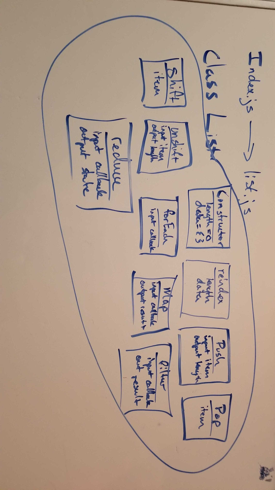

# LAB - 02 Classes, Inheritance, Functional Programming

### Author: Morgan T. Shaw

### Links and Resources
* [submission PR](https://github.com/morgan-401-advanced-javascript/lab02/pull/1)
* [travis](https://www.travis-ci.com/morgan-401-advanced-javascript/lab02/builds/130128780)

#### Documentation
* [api docs](http://xyz.com) (API servers)
* [jsdoc](http://xyz.com) (Server assignments)
* [styleguide](http://xyz.com) (React assignments)

### Modules
jest
eslint

#### `list.js`
#### `validator.js`
#### `vehicle-constructor.js`
#### `vehicle-class.js`
##### Exported Values and Methods

  
#### Tests
npm test

#### UML
Link to an image of the UML for your application and response to events
